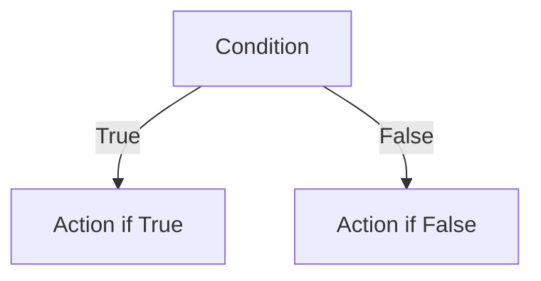
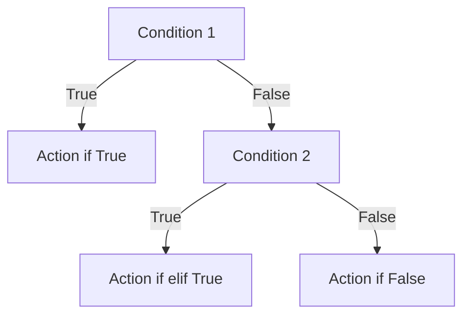
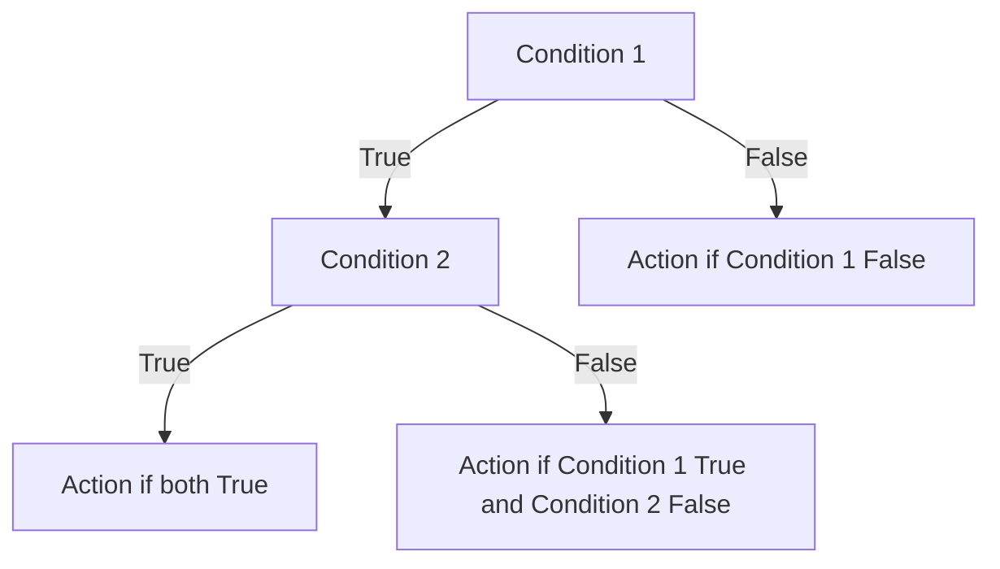
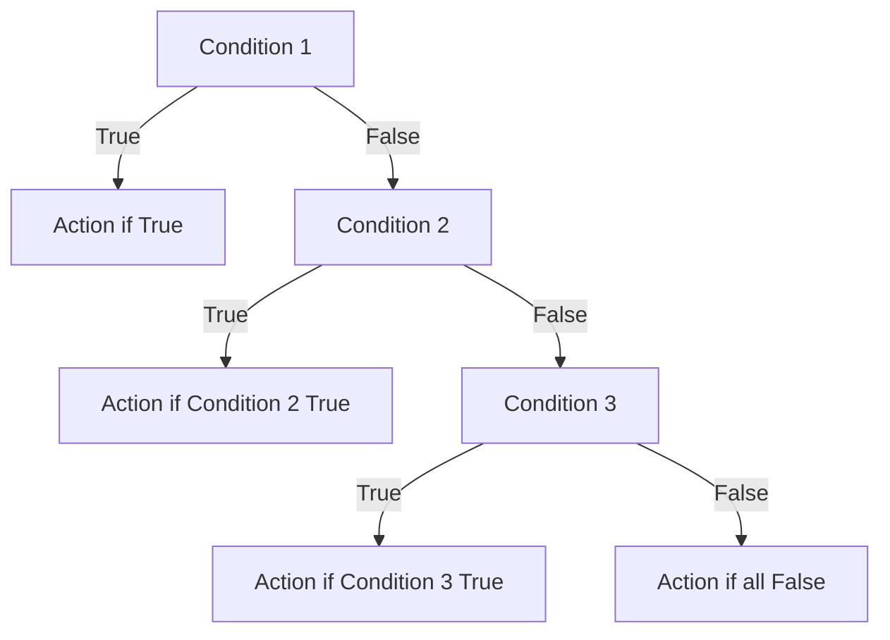
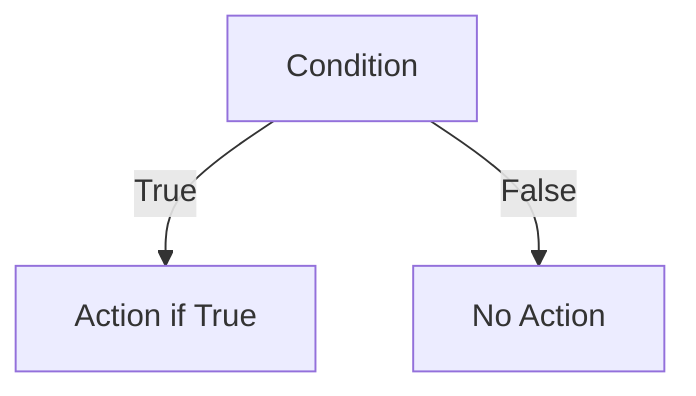

Certainly! Here are all the possible if-else scenarios presented using Mermaid diagrams in MDX format:

### If-Else Scenarios in Diagram Form

#### 1. Simple if-else Statement

#### 2. if-elif-else Statement

#### 3. Nested if-else Statement

#### 4. Multiple elif Statements

#### 5. if Statement without else

#### 6. if-else if-else with Nested Conditions

These diagrams provide a comprehensive visual representation of different if-else scenarios, showcasing how conditions flow through various statements. You can adjust or expand these based on specific requirements or preferences.